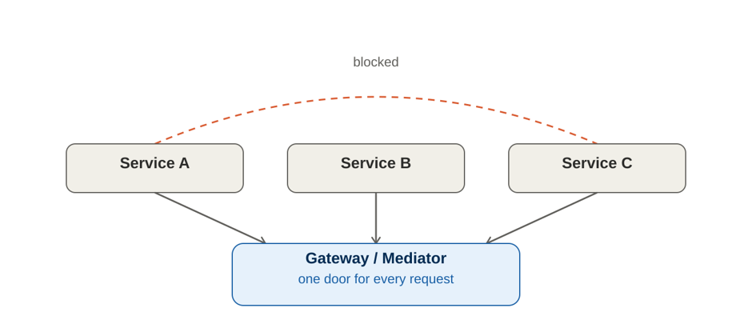
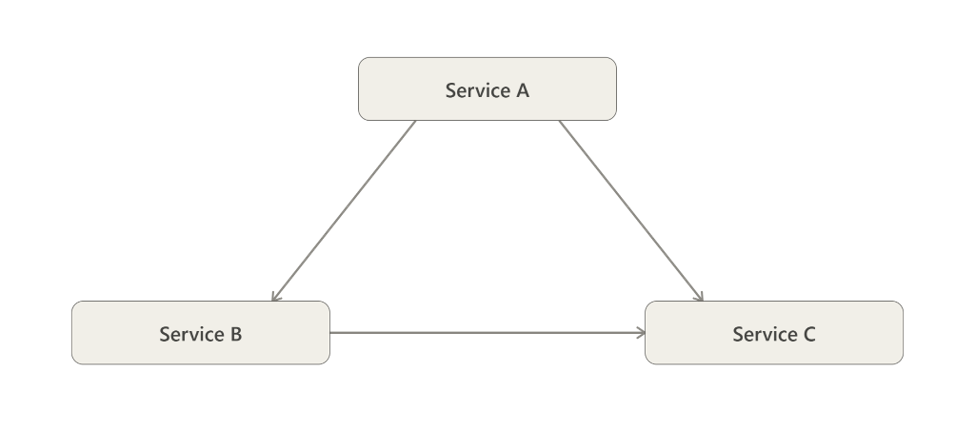
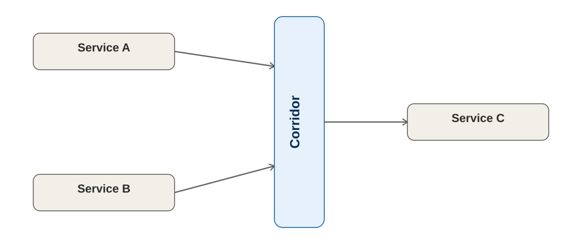

# isolation-tax
An architectural principle on when to enforce lateral isolation between peer services

## Temptation

Imagine three services — call them Service A, Service B, and Service C. (This is a deliberately simplified 
illustration, not a real incident — the pattern is common enough that a stylized example serves better than 
a specific war story.) Service A needs one small thing from Service C: a lookup, a status check, a single field. 
The direct call is one line of code and a network hop away. Going through a shared entry point instead means 
an extra round trip, another log line, another thing to configure.

That's the moment this article is about. Not the architecture diagram — the moment right before someone decides 
whether to take the shortcut.

## Lateral Isolation

Lateral Isolation is the architectural principle of preventing direct communication between peer components 
by requiring all interactions to pass through a controlled boundary.

**Figure 1. Direct Peer-to-Peer Communication (Without Lateral Isolation)**

**Figure 2. Controlled Communication Through a Shared Boundary (With Lateral Isolation)**
 